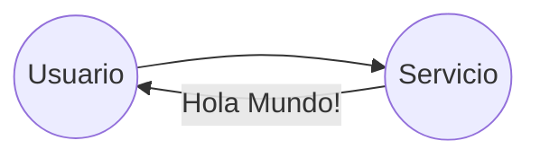

# Hola mundo

_"Hola Mundo"_[^holamundowiki] Desde carnigan y richie se ha convertido en el faro del programador. 
Asi como se espera que un bebé diga "Mamá" o "Papá", un programador espera lograr 
que su primer programa transmita las palagras magicas

> _Hola Mundo_

[^holamundowiki]: https://es.wikipedia.org/wiki/Hola_mundo
