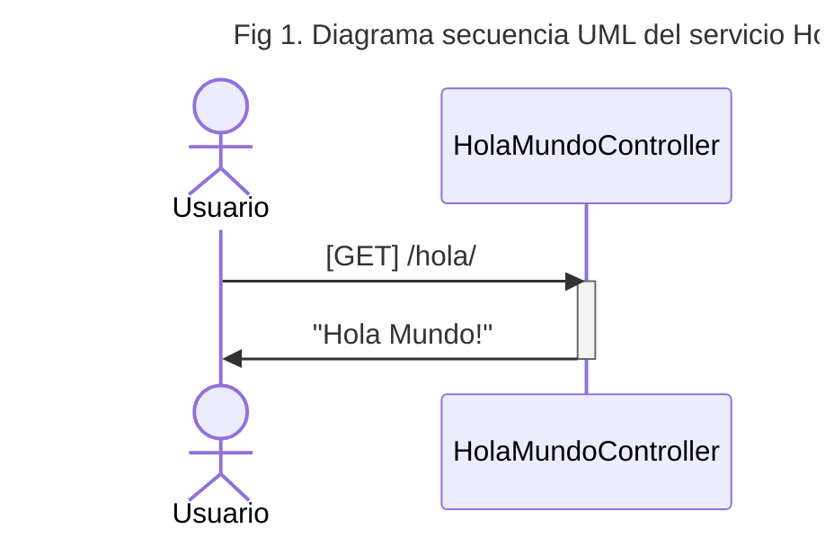

# Hola Mundo versión Micro Servicio REST


En este escenario vamos a tener un servicio _"HolaMundo"_ con el cual un usuario va a interactuar para obtener el deseado "Hola Mundo!".


Dado que hablamos de un Micro Servicio REST, el acceso al servicio HolaMundo esta dado por un path en una URL, en este caso `/hola/`,
al cual la respuesta va a ser siempre "`Hola Mundo!`"




A este interacción prefijada determina un contrato entre el usuario y el servicio, ya que ante cada invocación a `/hola/` la respuesta va a ser el esperada `Hola Mundo!`.

Este contrato lleva el nombre de API[^api_note] y existen muchas maneras de representarlos, graficamente (Fig 1.) usando UML[^UMLwiki] y de manera programatica usando diferentes formatos, el que vamos a usar es el definido por OpenAPI[^openapi] mediante el cual la intereacción en nuestra API se representaría:  


[^UMLwiki]: _https://es.wikipedia.org/wiki/Lenguaje_unificado_de_modelado_

[^api_note]: _API viene de Application Programming Interface, Interfaz de Programación de Aplicación y del mismo modo que una interfaz de usuario establece los modos en los que un usuario interactua con una aplicación, una API establece como se interactua un componente (que puede estar definido como una libreria o como un servicio independiente) dentro de una aplicación._
[^openapi]: https://www.openapis.org/

```yaml
#Snipped
paths:
  /hola/:
    get:
      tags:
      - hola-mundo-rest-simple-controller
      summary: Hola Mundo
      operationId: hola
      responses:
        "200":
          description: Saludo Hola Mundo
          content:
            text/plain:
              schema:
                type: string
```
